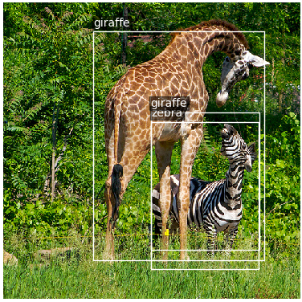
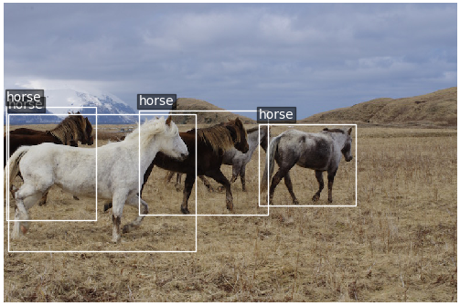
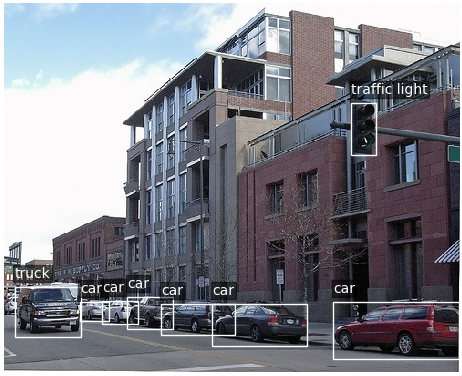
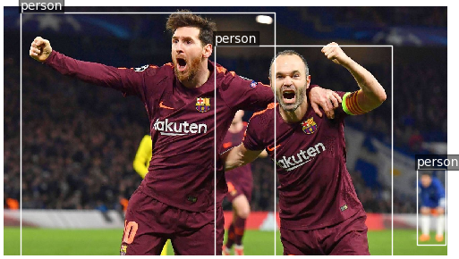

# PyTorch-YOLOv3
Minimal implementation of YOLOv3

## Table of Contents
- [PyTorch-YOLOv3](#pytorch-yolov3)
  * [Table of Contents](#table-of-contents)
  * [Installation](#installation)
  * [Run Inference](#run-inference)
  * [Credit](#credit)

## Installation
    $ git clone https://github.com/eriklindernoren/PyTorch-YOLOv3
    $ cd PyTorch-YOLOv3/
    $ sudo pip3 install -r requirements.txt
    $ cd weights/
    $ bash download_weights.sh

## Run Inference
    $ python3 test.py --image_folder /data/samples

## Credit
Inspired by https://github.com/ayooshkathuria/pytorch-yolo-v3
